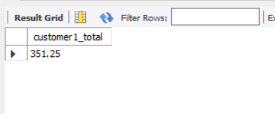
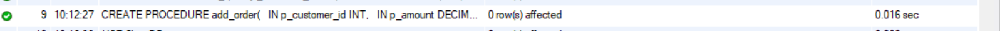
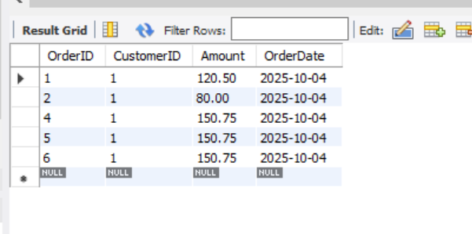
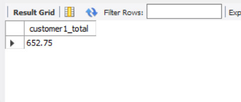

# 📄 Task 8 — Stored Procedures & Functions

## 🎯 Objective
The goal of this task is to understand and implement **Stored Procedures** and **Functions** in SQL using MySQL Workbench.  
You will create a database, add tables, write a procedure and a function, and then test them with sample data.

---

## 🗄️ Database Schema
**Database Name:** `ShopDB`

### 🧱 `schema.sql`
```sql
CREATE DATABASE IF NOT EXISTS ShopDB;
USE ShopDB;

CREATE TABLE IF NOT EXISTS Customers (
  CustomerID INT AUTO_INCREMENT PRIMARY KEY,
  Name VARCHAR(100),
  Email VARCHAR(150)
);

CREATE TABLE IF NOT EXISTS Orders (
  OrderID INT AUTO_INCREMENT PRIMARY KEY,
  CustomerID INT,
  Amount DECIMAL(10,2),
  OrderDate DATE DEFAULT (CURDATE()),
  FOREIGN KEY (CustomerID) REFERENCES Customers(CustomerID)
);

INSERT INTO Customers (Name, Email) VALUES
('Isha Sadavarte','isha@example.com'),
('Rahul Sharma','rahul@example.com');

INSERT INTO Orders (CustomerID, Amount) VALUES
(1, 120.50),
(1, 80.00),
(2, 200.00);
```

---

## ⚙️ Stored Function

### 🧩 `functions.sql`
```sql
DELIMITER $$
CREATE FUNCTION total_spent(p_customer_id INT)
RETURNS DECIMAL(10,2)
DETERMINISTIC
BEGIN
  DECLARE v_total DECIMAL(10,2) DEFAULT 0.00;
  SELECT IFNULL(SUM(Amount),0) INTO v_total
  FROM Orders
  WHERE CustomerID = p_customer_id;
  RETURN v_total;
END $$
DELIMITER ;
```

✅ **Purpose:**  
Calculates and returns the total amount spent by a specific customer.

**Test Query:**
```sql
SELECT total_spent(1) AS customer1_total;
```

📸 **Screenshot 2:** *Function created and tested successfully.*  



---

## 🧮 Stored Procedure

### ⚙️ `procedures.sql`
```sql
DELIMITER $$
CREATE PROCEDURE add_order(
  IN p_customer_id INT,
  IN p_amount DECIMAL(10,2),
  OUT p_order_id INT
)
BEGIN
  DECLARE v_exists INT DEFAULT 0;
  SELECT COUNT(*) INTO v_exists FROM Customers WHERE CustomerID = p_customer_id;

  IF v_exists = 0 THEN
    SIGNAL SQLSTATE '45000' SET MESSAGE_TEXT = 'Customer does not exist';
  ELSE
    INSERT INTO Orders (CustomerID, Amount) VALUES (p_customer_id, p_amount);
    SET p_order_id = LAST_INSERT_ID();
  END IF;
END $$
DELIMITER ;
```

✅ **Purpose:**  
Adds a new order for a customer and returns the generated `OrderID`.

**Test Query:**
```sql
CALL add_order(1, 150.75, @new_order_id);
SELECT @new_order_id AS inserted_order_id;
```

📸 **Screenshot 3:** *Procedure created successfully and order inserted.*  


---

## 🔍 Testing & Validation

### 🧾 `test_queries.sql`
```sql
-- Verify all orders for Customer 1
SELECT * FROM Orders WHERE CustomerID = 1;

-- Check updated total after new order
SELECT total_spent(1) AS updated_total;
```

📸 **Screenshot 4:** *All orders for Customer 1*  


📸 **Screenshot 5:** *Updated total spent by Customer 1*  



---

## 🧰 Files Included
| File Name | Description |
|------------|-------------|
| `schema.sql` | Database schema & sample data |
| `functions.sql` | Function creation script |
| `procedures.sql` | Procedure creation script |
| `test_queries.sql` | Test queries |
| `screenshots/` | Folder containing query result screenshots |
| `README.md` | Documentation file |

---

## 🧠 Key Concepts
- Creation and execution of **Stored Procedures** and **Functions**
- Use of **IN**, **OUT**, and **INOUT** parameters
- Conditional logic using `IF` and `SIGNAL`
- Aggregate function usage inside stored routines
- Executing stored routines using `CALL` and `SELECT`

---

## 🖼️ Screenshot Checklist
✅ `schema.sql` — Tables created and data inserted  
✅ `functions.sql` — Function created and tested  
✅ `procedures.sql` — Procedure created successfully  
✅ `test_queries.sql` — Verification of outputs  

---


--

